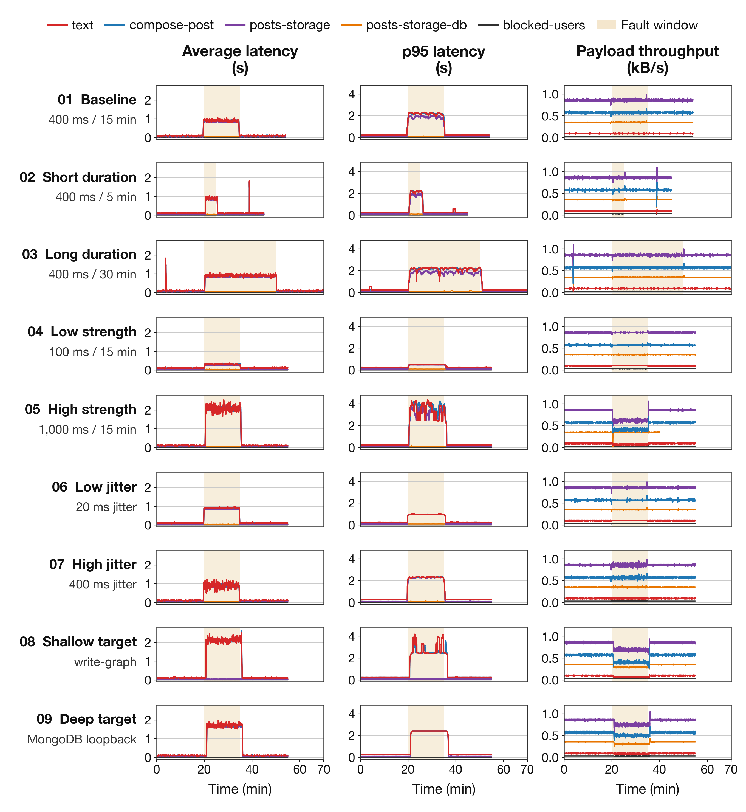
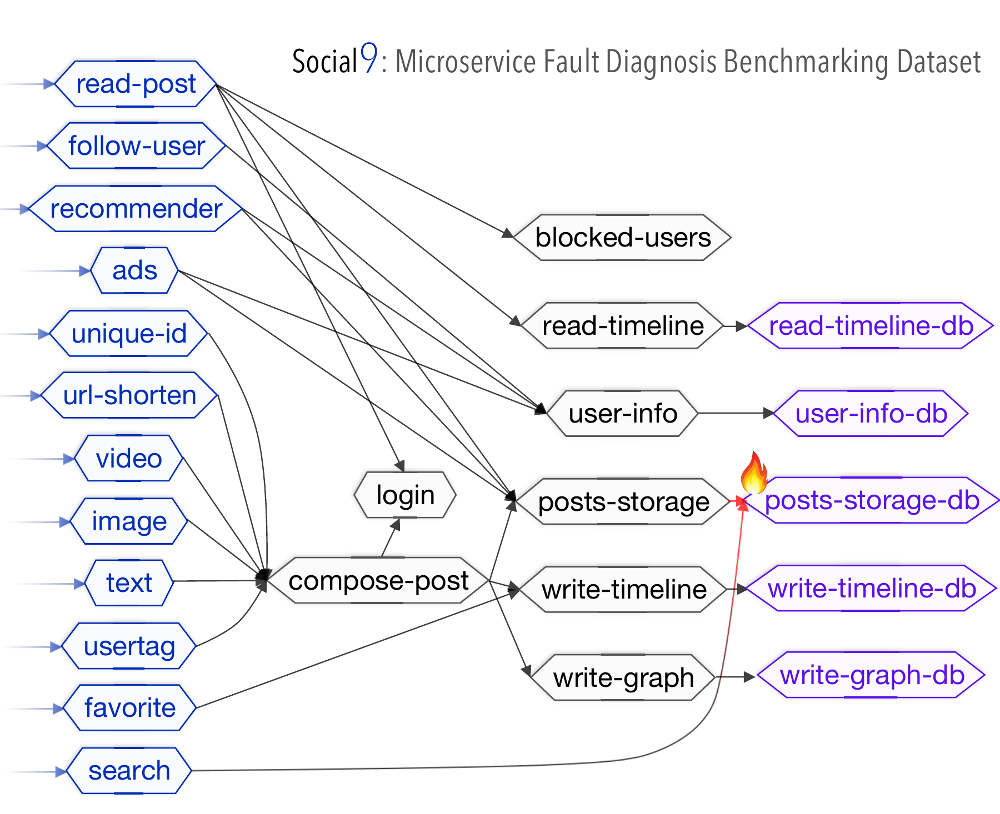
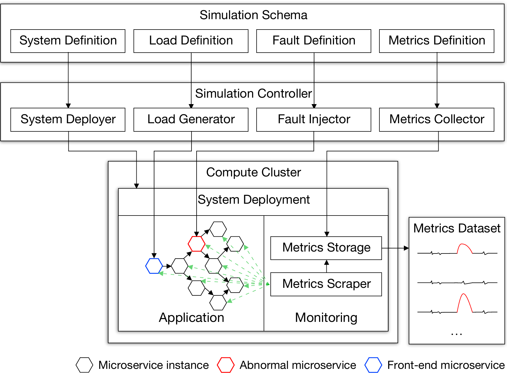

# 🧪 VECROsim

### A Versatile Metric-oriented Microservice Fault Simulation System

**ISSRE 2022 · Tools and Artifact Track**  
[Paper](https://doi.org/10.1109/ISSRE55969.2022.00037) · [Service image](https://github.com/etigerstudio/vecro-base) · [MongoDB image](https://github.com/etigerstudio/vecro-mongodb)

VECROsim is a configurable microservice fault simulator for performance-metric research. A YAML definition describes services, their workloads and calling relationships; Kubernetes runs the system, and Prometheus records its behavior under request load and injected faults. The resulting time series support root cause analysis and other studies of complex systems.

The paper releases **Social9**: 25 services, seven metric families sampled at 1 Hz, and nine fault scenarios varying duration, strength, jitter and fault location. [Download Social9](https://github.com/etigerstudio/VECROsim/releases/tag/social9-dataset).

[Demo](#demo-nine-fault-scenarios) · [Social9 topology](#social9-topology) · [Framework](#vecrosim-framework) · [Quick start](#quick-start-the-social-example) · [Configuration](#configuration-reference) · [Citation](#citation)

## Demo: nine fault scenarios



**Figure 10. Metric responses across nine Social9 fault scenarios.** Rows show the baseline and eight variations in fault duration, delay strength, jitter or target depth. Columns show average latency, p95 latency and payload throughput; colors identify the five services named in the legend. Shading marks the configured fault window, beginning at 20 minutes and lasting 5, 15 or 30 minutes according to the scenario. The baseline delays `posts-storage-db` by 400 ms for 15 minutes with 150 ms jitter. The shallow-target case affects `write-graph`; the deep-target case delays the agent-to-MongoDB loopback connection.

*Figure notes:* Replotted from the [released Social9 dataset](https://github.com/etigerstudio/VECROsim/releases/tag/social9-dataset), using `social_latency_avg.csv`, `social_latency_p95.csv` and `social_throughput.csv`. Original 1 Hz observations are retained without smoothing or interpolation. Time is measured from the start of each recording; latency is in **seconds**, and throughput is in **kB/s** (1 kB = 1,000 bytes). Axis scales are shared within each metric column. Each curve stops when its recording ends; blank tails are not zero-valued observations. The full 70-minute long-duration recording is included.

[Vector redraw](assets/social9-metrics-redrawn.pdf) · [Original Figure 10](assets/social9-metrics.png) · [Social9 dataset](https://github.com/etigerstudio/VECROsim/releases/tag/social9-dataset)

## Social9 topology



**Paper Figure 9.** Social9 has 25 services: 12 front-end logic services (blue), eight intermediate logic services (gray) and five MongoDB services (purple). An arrow from A to B means A calls B. The highlighted `posts-storage-db` is the target of the baseline network-delay fault.

## VECROsim framework



**Paper Figure 1.** A simulation schema specifies the system, request load, fault and metrics. The simulation controller coordinates deployment, load generation, fault injection and metric collection around the compute cluster, producing the performance-metric dataset.

## What you can configure

| Component | What it controls | Entry point |
| --- | --- | --- |
| Topology | Services, replicas, service types and downstream calls | `deploy/base/social.yaml` |
| Workload | CPU, I/O, memory, response payload and MongoDB reads/writes | `deploy/base/workload.go` |
| Request load | Concurrent users, request spacing and experiment duration | `load/` |
| Fault scenario | Network delay/loss/rate and CPU/I/O stress | `inject/` |
| Observation | Application and container metrics exported as CSV | `metrics/social_collect.py` |

The released deployer implements **base** and **MongoDB** services. The two service images live in separate repositories; cloning this repository alone does not provide their source. The included Social example has 25 services, including five MongoDB services.

## Quick start: the Social example

These commands describe the released layout and assume Linux/macOS, Go, Docker, `kubectl`, a configured Kubernetes cluster and **linux/amd64 worker nodes**. Adjust the binary architecture for other workers. Install Chaos Mesh separately if you use the supplied `NetworkChaos` example. For a local cluster, the image-loading commands below use Minikube.

### 1. Obtain the three repositories and build the images

```bash
git clone https://github.com/etigerstudio/VECROsim.git
git clone https://github.com/etigerstudio/vecro-base.git
git clone https://github.com/etigerstudio/vecro-mongodb.git

(cd vecro-base && GOOS=linux GOARCH=amd64 CGO_ENABLED=0 go build -o vecro-base .)
docker build -t vecro-base:v1 ./vecro-base

(cd vecro-mongodb && GOOS=linux GOARCH=amd64 CGO_ENABLED=0 go build -o vecro-mongodb .)
docker build -t vecro-mongodb:v1 ./vecro-mongodb

minikube image load vecro-base:v1
minikube image load vecro-mongodb:v1
cd VECROsim
```

For other clusters, make the images available to the worker nodes. The deployer currently uses the fixed names `vecro-base:v1`, `vecro-mongodb:v1` and `mongo:4.2`; registry-qualified names require adapting `deploy/base/deploy.go`.

### 2. Set up monitoring and deploy services

```bash
(cd metrics/setup && bash setup.sh)
kubectl create namespace social
kubectl create configmap mongo-initjs -n social --from-file=mongo-init.js=../vecro-mongodb/mongo-init.js

(cd deploy && go run . -deffile base/social.yaml)
kubectl apply -f deploy/base/social-monitor.yaml
kubectl get pods -n social
```

Wait for the services to become ready before sending requests. The namespace and MongoDB initialization ConfigMap are required by the released deployer. Monitoring setup must run from `metrics/setup/` because its script uses relative manifest paths.

### 3. Apply load and inject the supplied delay fault

In one terminal, expose the frontend:

```bash
kubectl port-forward -n social svc/social-text 8080:80
```

In a second terminal, from the repository root:

```bash
(cd load && go run . -delay 100ms -duration 2h -users 5 -url "http://localhost:8080")
```

After collecting a normal baseline, apply the supplied Chaos Mesh fault in another terminal:

```bash
kubectl apply -f inject/social-delay.yaml
```

This manifest targets **`posts-storage-db`** with **400 ms latency**, **150 ms jitter** and a **30-minute duration**. It uses Chaos Mesh's CRD, rather than the legacy Go injector's configuration format.

### 4. Export metrics

Expose Prometheus in a separate terminal:

```bash
kubectl port-forward -n monitoring svc/prometheus-k8s 9091:9090
```

The collector requires `pandas` and `prometheus-api-client`. Before running it, set `start_time`, `end_time` and `filepath` in `metrics/social_collect.py` to the window and destination of your experiment, and create the destination directory.

```bash
python -m pip install pandas prometheus-api-client
mkdir -p social-delay/jitter_high
python metrics/social_collect.py
```

The script exports one CSV per metric family, with service names as columns. It includes latency, throughput, CPU, memory and network metrics. **Check the PromQL names first:** the collector retains a `ben_base_social_*` prefix, while the current companion service images expose `vecro_base_social_*`. Adapt the three application-metric queries to your deployed images. The collector expects exactly one returned series per service and query.

## Repository map

```text
deploy/     YAML-driven Kubernetes deployment; Social and Alphabet examples
load/       concurrent request generator
inject/     legacy Go injector plus separate Chaos Mesh example manifests
metrics/    monitoring manifests and Prometheus-to-CSV collector
cmd/        additional command entry point
```

## Configuration reference

A system definition declares the graph of service calls. For example:

```yaml
name: example
replicas: 1
namespace: example
services:
  - name: frontend
    type: base
    workload:
      cpu: 1
      memory: 16
      net: 256
    calls:
      - storage
  - name: storage
    type: mongodb
    workload:
      read: 1
      write: 1
```

| Service type | Implemented workload fields |
| --- | --- |
| `base` | `cpu`, `io`, `memory`, `net`, `delay` |
| `mongodb` | `read`, `write` |

The legacy Go injector accepts `name`, `namespace` and a `faults` list, with a target, start time, duration and behaviors (`net-delay`, `net-loss`, `net-rate`, `cpu-stress`, `io-stress`). It uses Pumba and Docker-oriented container access; its runtime requirements differ from the Chaos Mesh manifests. See `inject/simple.yaml` and `inject/faults/` before choosing that route.

The main commands accept `-deffile` for YAML configuration and `-kubeconfig` for a non-default Kubernetes configuration. The load generator accepts `-url`, `-users`, `-delay`, `-duration` and `-body`.

## Citation

```bibtex
@inproceedings{bi2022vecrosim,
  title={VECROsim: A Versatile Metric-oriented Microservice Fault Simulation System (Tools and Artifact Track)},
  author={Bi, Tingzhu and Pan, Yicheng and Jiang, Xinrui and Ma, Meng and Wang, Ping},
  booktitle={2022 IEEE 33rd International Symposium on Software Reliability Engineering (ISSRE)},
  pages={297--308},
  year={2022},
  doi={10.1109/ISSRE55969.2022.00037}
}
```
